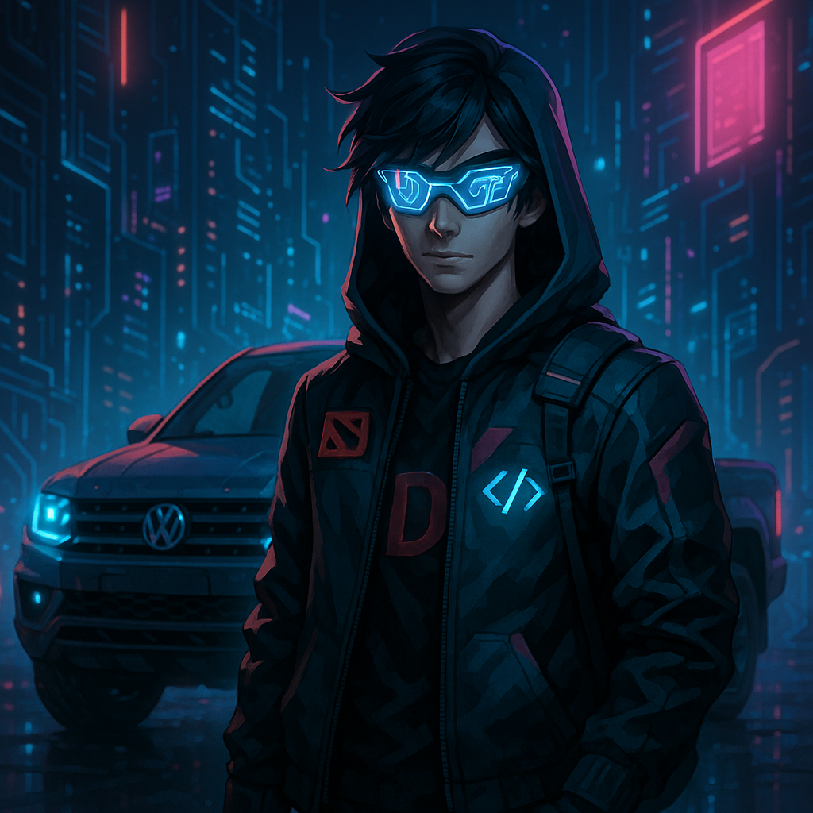
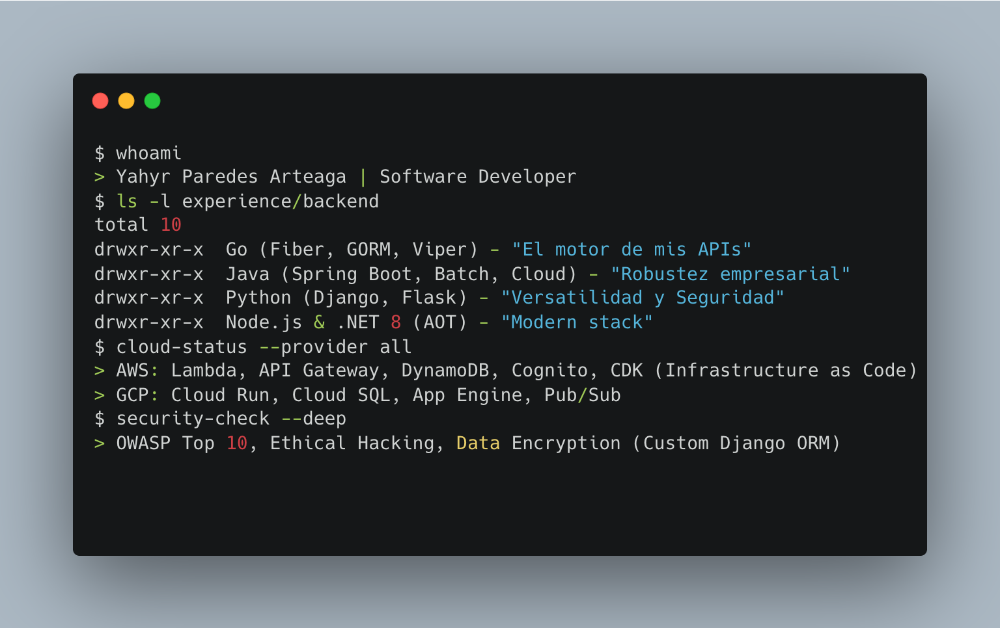

<div align="center">

  <h1>Yahyr Enrique Paredes Arteaga </h1>

  <p>
    
    
    
    
    
    
  </p>

[//]: # (  )

</div>

---

<h2 align="center">Problem Solver</h2>

<p align="center">
  <em>Convierto incertidumbre en sistemas funcionales y presión en entregas confiables.</em>
</p>

<table>
  <tr>
    <td width="65%" valign="top">
        <p>
            Soy un desarrollador orientado a resultados que trabaja con eficacia en entornos complejos: requisitos ambiguos, sistemas heredados y plazos exigentes.        
        </p>
        <p>
        Como T-shaped Developer, combino profundidad técnica con la capacidad de adaptarme rápidamente a distintos stacks. Me enfoco en entender el problema, tomar decisiones sólidas y ejecutar con precisión.      
        </p>
        <p>
            He trabajado construyendo y evolucionando sistemas backend y aplicaciones, priorizando rendimiento, mantenibilidad y escalabilidad. Me adapto tanto a proyectos desde cero como a código existente, siempre alineado a objetivos de negocio.      
        </p>        
        <p>
            Mi enfoque es simple: entregar software robusto, que funcione bien hoy y siga funcionando mañana.      
        </p>
    </td>
    <td width="35%" align="center">
      
      <br/>
      <sub><b>Build fast. Build right. Ship with confidence — even under pressure.</b></sub>
    </td>
  </tr>
</table>

---
 

### The "Software Journey" 

> **+5 años construyendo software de impacto.**  
> He evolucionado de Android nativo (XML/MVP) a arquitecturas modernas con **Kotlin Multiplatform**, y de monolitos en Java y Python a **microservicios en Go y Python**.  
> Hoy mi stack combina **backend escalable, cloud y mobile cross-platform** para entregar productos robustos de punta a punta.
 

### Backend & Cloud

 
<!-- ```bash
$ whoami
> Yahyr Paredes Arteaga | Software Developer
$ ls -l experience/backend
total 10
drwxr-xr-x  Go (Fiber, GORM, Viper) - "El motor de mis APIs"
drwxr-xr-x  Java (Spring Boot, Batch, Cloud) - "Robustez empresarial"
drwxr-xr-x  Python (Django, Flask) - "Versatilidad y Seguridad"
drwxr-xr-x  Node.js & .NET 8 (AOT) - "Stack que lo usas cuando lo necesitas"
$ cloud-status --provider all
> AWS: Lambda, API Gateway, DynamoDB, Cognito, CDK (Infrastructure as Code)
> GCP: Cloud Run, Cloud SQL, App Engine, Pub/Sub
$ security-check --deep
> OWASP Top 10, Ethical Hacking, Data Encryption (Custom Django ORM)
``` -->

<div align="center">
  
  
  
  
  
</div>

---

### Mobile Development
 
> ¿Sabías que pasé de Android XML (MVP) a **Jetpack Compose** y ahora **Kotlin Multiplatform (KMP)**?  
> He trabajado en apps de alto impacto como **Starbucks Perú** y sistemas de seguridad con **BLE Beacons** en Kwema.

<div align="center">
   
  
  
  
 </div>


**Highlights:**

- **Security First:** Implementación de **DexGuard** y **R8** para protección de código.
- **Observability:** Instrumentación con **New Relic**, **Firebase** y **GTM**.
- **Performance:** Animaciones complejas y optimización de lifecycle.
- **IoT:** Integración con **Bluetooth Low Energy (BLE)** para wearables y pánico.

---

### Featured Projects 

**Starbucks Rewards Perú (Delosi)**  
*Mobile Team - Android/KMP*  
Desarrollo de la nueva versión usando **KMP**, **Compose** y **SwiftUI**. Implementación de seguridad con **DexGuard** y
consumo de servicios con **Ktor**.

**Arquitectura & Core Backend (Interseguro)**  
*Backend Engineer - SQUAD Nuevas Iniciativas / SOAT*  
Lideré la definición de arquitectura y desarrollo de microservicios críticos en **Golang** (Fiber, GORM) y **Java Spring
Boot**. Implementé sistemas de procesamiento batch, generación de PDFs cifrados y wallets móviles, logrando optimizar el
performance y la escalabilidad de productos con alto volumen de ventas. Instrumentación completa con **New Relic** y
despliegue en **GCP (Cloud Run)**.

**Workplace Safety (Kwema Inc)**  
*Software Engineer*  
Reescritura completa de la app usando **Compose** e integración con **IBeacons** para alertas de seguridad en tiempo
real.

---

### GitHub Stats & Activity

<div align="center">
  
  <!--img src="https://github-readme-stats.vercel.app/api/top-langs/?username=yahyrparedes&layout=compact&theme=tokyonight" alt="Top Langs" /-->
</div>

---

### Let's Connect!

<div align="center">
  <a href="https://www.linkedin.com/in/yahyrparedes/">
    
  </a>
  <a href="https://orcid.org/0009-0004-5624-1396">
    
  </a>
  <a href="mailto:yahyrparedesarteaga@gmail.com">
    
  </a>
</div>

<div align="right">
  
</div>
